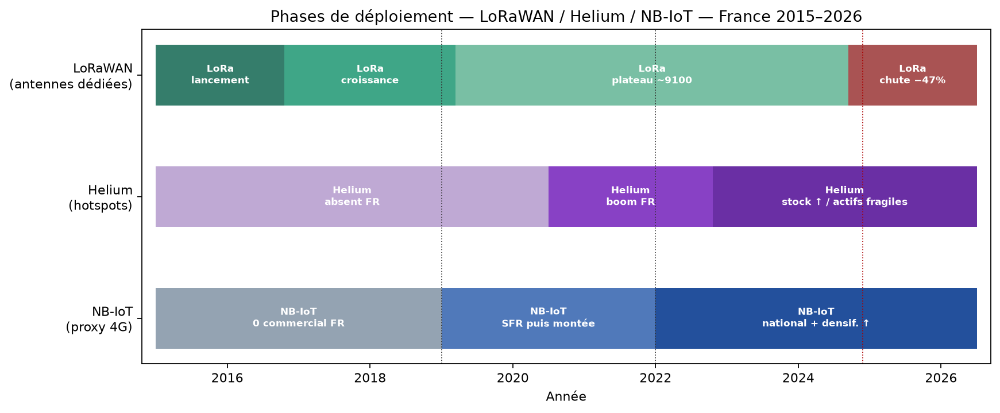
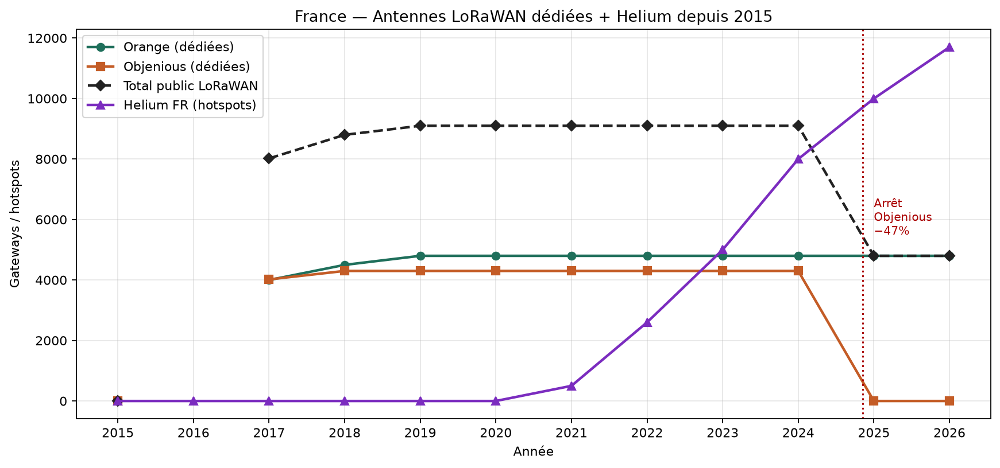
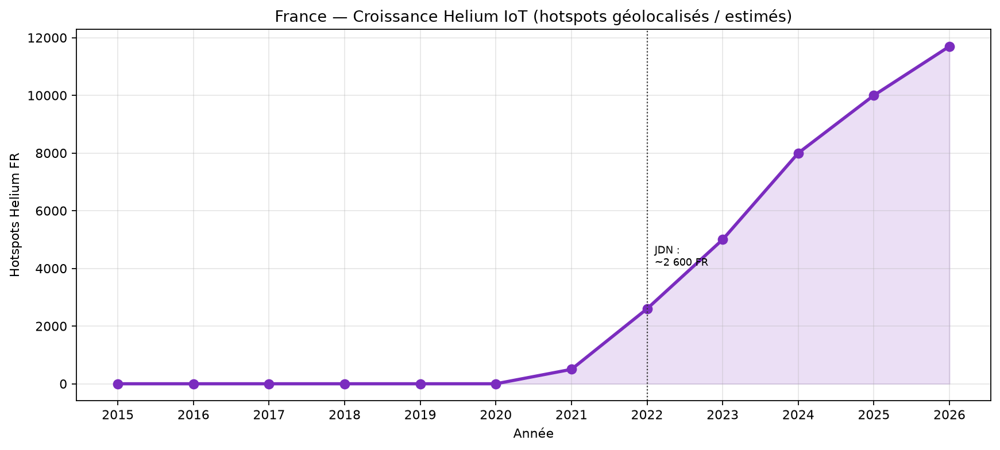
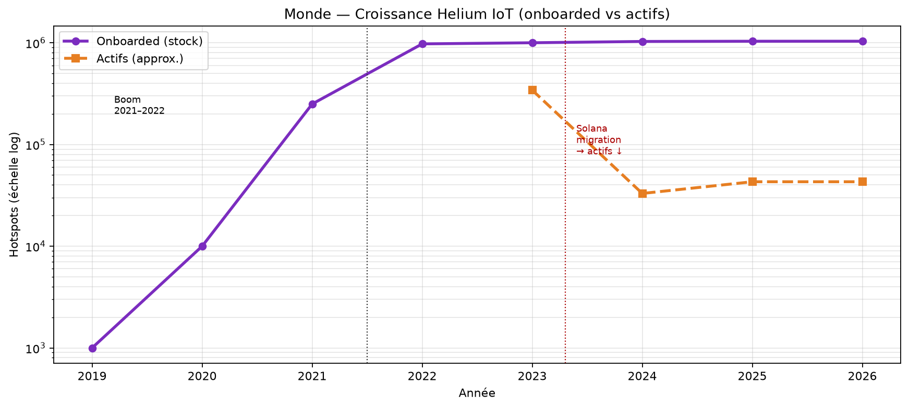
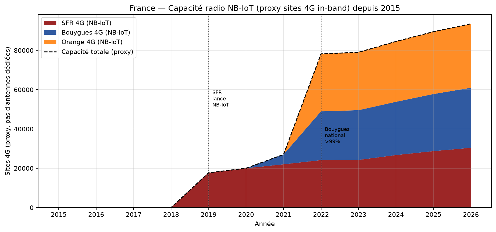
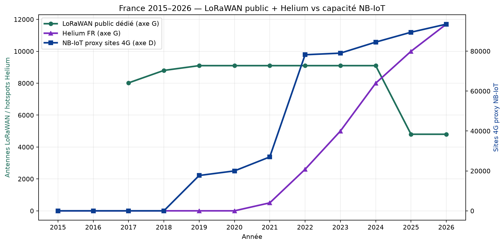

# Antennes LoRaWAN / Helium vs capacité NB-IoT — France depuis 2015

Comparer des gateways LoRaWAN à des sites 4G n'est pas un comptage homogène :
un site 4G NB-IoT mutualise voix/data/IoT ; une antenne LoRa est dédiée LPWAN.
L'analyse porte sur la DYNAMIQUE (croissance/décroissance) et les ordres de grandeur.

## Tableau annuel

| Année | Orange LoRa | Objenious | Total LoRa public | Helium FR | Helium monde onboarded | Proxy NB-IoT |
|---:|---:|---:|---:|---:|---:|---:|
| 2015 | 0 | 0 | 0 | 0 | — | 0 |
| 2016 | — | — | — | 0 | — | 0 |
| 2017 | 4 000 | 4 020 | 8 020 | 0 | — | 0 |
| 2018 | 4 500 | 4 300 | 8 800 | 0 | — | 0 |
| 2019 | 4 800 | 4 300 | 9 100 | 0 | 1 000 | 17 700 |
| 2020 | 4 800 | 4 300 | 9 100 | 0 | 10 000 | 20 000 |
| 2021 | 4 800 | 4 300 | 9 100 | 500 | 250 000 | 27 000 |
| 2022 | 4 800 | 4 300 | 9 100 | 2 600 | 975 000 | 78 193 |
| 2023 | 4 800 | 4 300 | 9 100 | 5 000 | 1 000 000 | 78 997 |
| 2024 | 4 800 | 4 300 | 9 100 | 8 000 | 1 030 000 | 84 521 |
| 2025 | 4 800 | 0 | 4 800 | 10 000 | 1 035 000 | 89 474 |
| 2026 | 4 800 | 0 | 4 800 | 11 700 | 1 035 532 | 93 516 |

## Tendances

### LoRaWAN opéré (antennes dédiées)
- 2015–2019 : CROISSANCE forte (0 → ~9100 antennes publiques)
- 2019–2024 : PLATEAU duopole Orange+Objenious (~9100)
- 2025–2026 : DÉCROISSANCE brutale (-47%) après arrêt Objenious → ~4800

### Helium (LoRaWAN communautaire / DePIN)
- 2019–2022 : CROISSANCE explosive mondiale (milliers → ~975k onboarded) ; FR ~0 → ~2600 en 2022
- 2023–2026 : Monde : stock onboarded élevé mais ACTIFS en baisse post-Solana (~33–43k) ; FR estim. ~12k géolocalisés (souvent inactifs)

### NB-IoT (proxy sites 4G)
- 2015–2018 : NÉANT commercial FR (0 site NB-IoT actif)
- 2019–2021 : CROISSANCE (SFR puis début Bouygues)
- 2022–2026 : CROISSANCE continue de la densification 4G sous-jacente (+20% SFR+Bouygues 2022→2026)

## Graphiques

