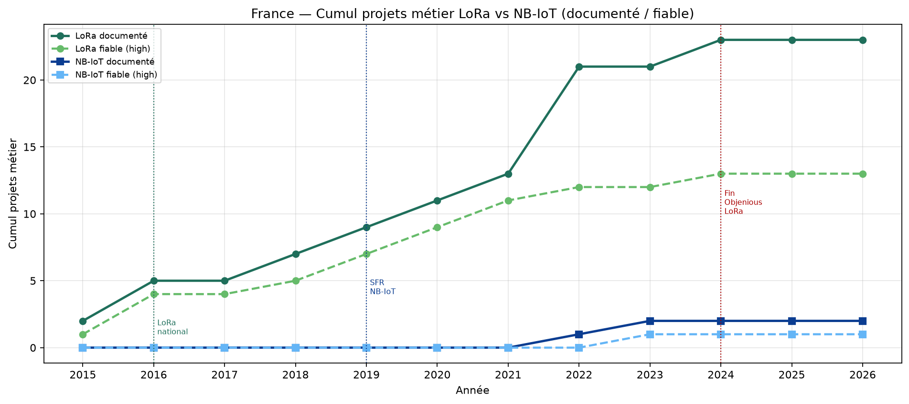
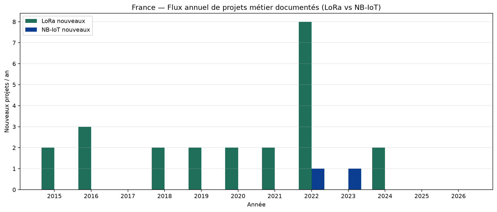
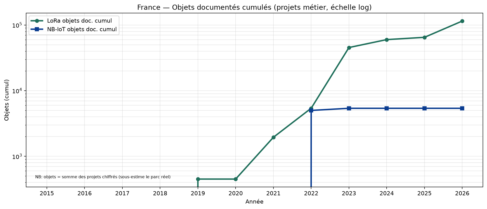
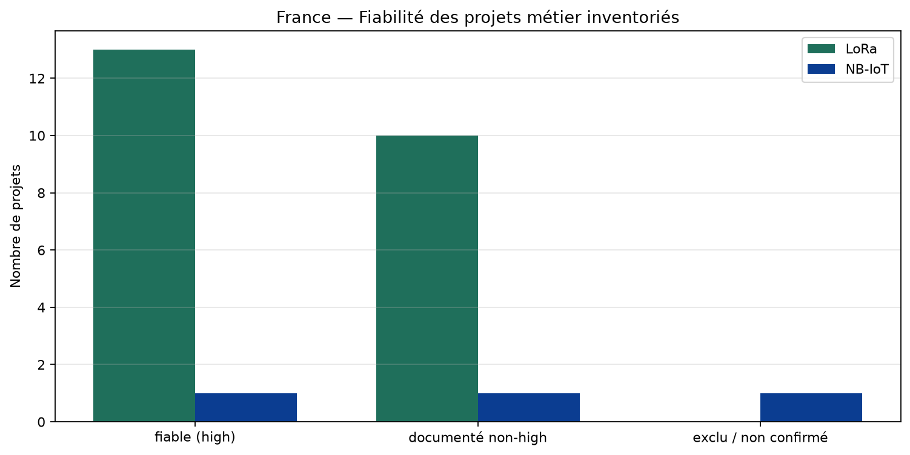
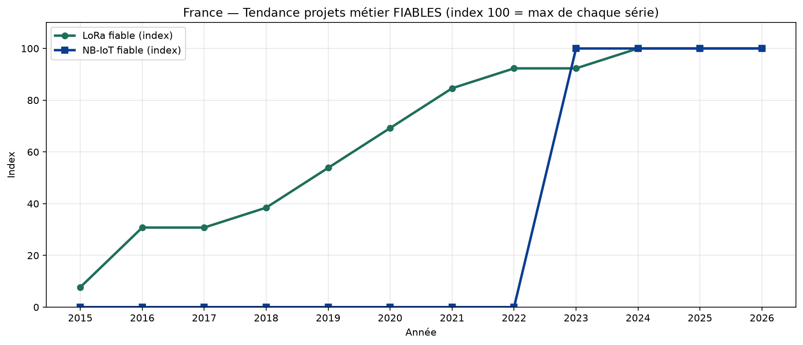

# Croisement projets métier LoRa vs NB-IoT — France depuis 2015

## Méthode & fiabilité

- **Projet métier** = usage concret documenté (pas la seule couverture radio).
- **Documenté** = inventaire nominatif sourcé, hors annonces non confirmées.
- **Fiable** = `confidence: high` + `include_in_fiable: true` (REX collectivité / sources fortes).
- Inventaires **non exhaustifs** : la tendance mesure l’échantillon documenté.

### Décisions d’audit (2026-07-21)

- LoRa : {'audited_at': '2026-07-21', 'rules': ['fiable = confidence high + projet métier documenté (pas couverture seule)', 'year_projet_metier utilisé for trend if present else year_start', 'Heyliot collectivités medium = documenté presse fournisseur']}
- NB-IoT : {'audited_at': '2026-07-21', 'rules': ['fiable = confidence high AND include_in_fiable!=False AND source primaire (REX collectivité / CP opérateur multiple / presse spécialisée concordante)', 'documente = inventaire nominatif hors annonces non confirmées', 'annonce_non_confirmee exclue du socle fiable et des objets'], 'nbiot_lyon_decision': 'EXCLU du socle fiable (EIN « prochainement » ; historique Homerider)', 'nbiot_montlucon_decision': 'INCLUS fiable (Aquagir citation directe NB-IoT)', 'nbiot_sfr_gutermann_decision': 'INCLUS documenté, EXCLU fiable (collectivité anonyme)'}

## Synthèse croisée

| Techno | Documentés | Fiables (high) | Objets doc. cumul |
|---|---:|---:|---:|
| LoRa | 23 | 13 | 114 955 |
| NB-IoT | 2 | 1 | 5 390 |

## Tendances (cumul documenté)

| Année | LoRa + | LoRa cumul | NB-IoT + | NB-IoT cumul | LoRa fiable cumul | NB-IoT fiable cumul |
|---:|---:|---:|---:|---:|---:|---:|
| 2015 | 2 | 2 | 0 | 0 | 1 | 0 |
| 2016 | 3 | 5 | 0 | 0 | 4 | 0 |
| 2017 | 0 | 5 | 0 | 0 | 4 | 0 |
| 2018 | 2 | 7 | 0 | 0 | 5 | 0 |
| 2019 | 2 | 9 | 0 | 0 | 7 | 0 |
| 2020 | 2 | 11 | 0 | 0 | 9 | 0 |
| 2021 | 2 | 13 | 0 | 0 | 11 | 0 |
| 2022 | 8 | 21 | 1 | 1 | 12 | 0 |
| 2023 | 0 | 21 | 1 | 2 | 12 | 1 |
| 2024 | 2 | 23 | 0 | 2 | 13 | 1 |
| 2025 | 0 | 23 | 0 | 2 | 13 | 1 |
| 2026 | 0 | 23 | 0 | 2 | 13 | 1 |

### Lecture des tendances

- **2015–2018** : LoRa ouvre des projets métier (pilotes puis métropoles) ; NB-IoT = **0** (pas encore commercial FR).
- **2019–2021** : LoRa continue (départements, smart city) ; NB-IoT = lancement opérateurs + écosystème, **toujours 0 projet métier fiable**.
- **2022–2026** : LoRa reste dominant en projets documentés ; NB-IoT n’apparaît qu’avec **peu de cas eau/fuites** (1 fiable : Montluçon).
- **Écart structurel** : couverture NB-IoT dense ≠ projets collectivités ; l’eau FR reste surtout LoRa/Birdz.

## Tableaux de fiabilité

### LoRa — projets métier

| Année | Projet | Fiable | Statut | Objets |
|---:|---|---|---|---:|
| 2015 | Grenoble | oui | source_primaire_ou_presse_forte | — |
| 2015 | Saint-Sulpice-la-Forêt | non | mention_secondaire_recit | — |
| 2016 | Montpellier Méditerranée Métropole | oui | source_primaire_ou_presse_forte | 50 000 |
| 2016 | Strasbourg | oui | source_primaire_ou_presse_forte | — |
| 2016 | Toulouse | oui | source_primaire_ou_presse_forte | — |
| 2018 | Bordeaux | oui | source_primaire_ou_presse_forte | — |
| 2018 | Issy-les-Moulineaux | non | mention_indirecte | — |
| 2019 | Dijon Métropole | oui | source_primaire_ou_presse_forte | 450 |
| 2019 | Rennes Métropole | oui | source_primaire_ou_presse_forte | — |
| 2020 | Département de l'Isère | oui | source_primaire_ou_presse_forte | — |
| 2020 | Sarthe (Sarthe Numérique) | oui | source_primaire_ou_presse_forte | 40 000 |
| 2021 | Communauté de communes Pays du Mont-Blanc | oui | source_primaire_ou_presse_forte | 1 500 |
| 2021 | Finistère (SDEF — Finistère Smart Connect) | oui | source_primaire_ou_presse_forte | — |
| 2022 | Communauté d'agglomération de Lens-Liévin | non | source_secondaire | 300 |
| 2022 | Communauté d'agglomération du Niortais | non | source_secondaire | 720 |
| 2022 | Istres | non | source_secondaire | — |
| 2022 | Pays de Montbéliard Agglomération | non | source_secondaire | 1 445 |
| 2022 | SMICOTOM Médoc | non | source_secondaire | 523 |
| 2022 | Saint-Malo Agglomération | non | source_secondaire | 457 |
| 2022 | Syndicat intercommunal des eaux de Ribemont (Aisne) | oui | source_primaire_ou_presse_forte | 14 560 |
| 2022 | Val d'Oise Numérique / Essonne Numérique / Seine-et-Marne Numérique | non | projet_infra_en_cours | — |
| 2024 | Département de la Somme | non | source_secondaire | — |
| 2024 | Indre (36) + Cher (18) — Berry Territoire Innovant | oui | source_primaire_ou_presse_forte | 5 000 |

### NB-IoT — projets métier

| Année | Projet | Fiable | Statut | Objets |
|---:|---|---|---|---:|
| 2022 | SFR × Gutermann — détection fuites (collectivité non nommée) | non | claim_operateur | 5 000 |
| 2023 | Montluçon Communauté | oui | rex_banque_territoires | 390 |
| 2023 | Métropole de Lyon / Eau du Grand Lyon ⚠️ | non | annonce_non_confirmee | — |

## Points de vérification clés

| Claim | Verdict | Preuve |
|---|---|---|
| Montpellier 50k LoRaWAN | **Confirmé** | Smart City Mag + témoignage métropole |
| Montluçon 390 NB-IoT | **Confirmé** | Aquagir/BdT citation directe |
| SFR×Gutermann 5000 NB-IoT | **Documenté, non localisé** | JDN Valérie Grau (SFR) — collectivité anonyme |
| Lyon 6000 NB-IoT | **Non retenu (faible)** | EIN « prochainement » ; historique 2015 = radio Homerider |
| Couverture NB-IoT ~99% pop. | **Couverture ≠ projets** | CP opérateurs |

## Graphiques

## Limites

- Pas de registre national Arcep des projets LPWAN.
- Sous-dénombrement probable (surtout NB-IoT industriel / tracking non public).
- Les objets chiffrés ne couvrent qu’une partie des projets.
