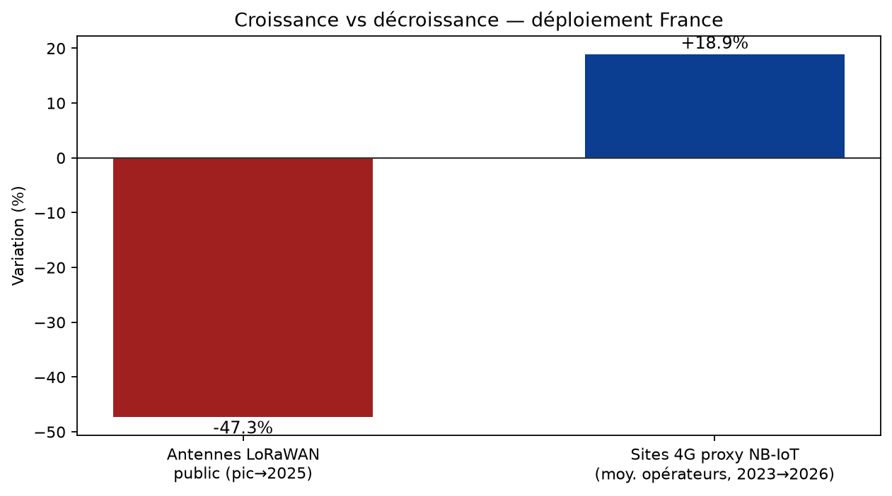
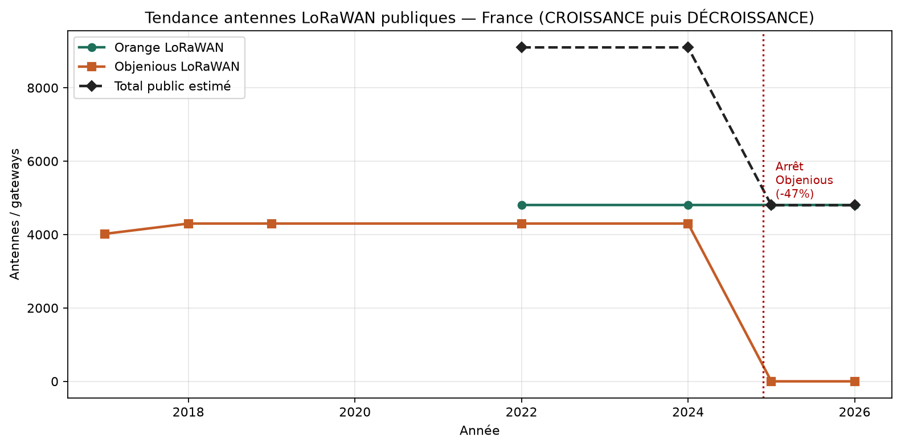
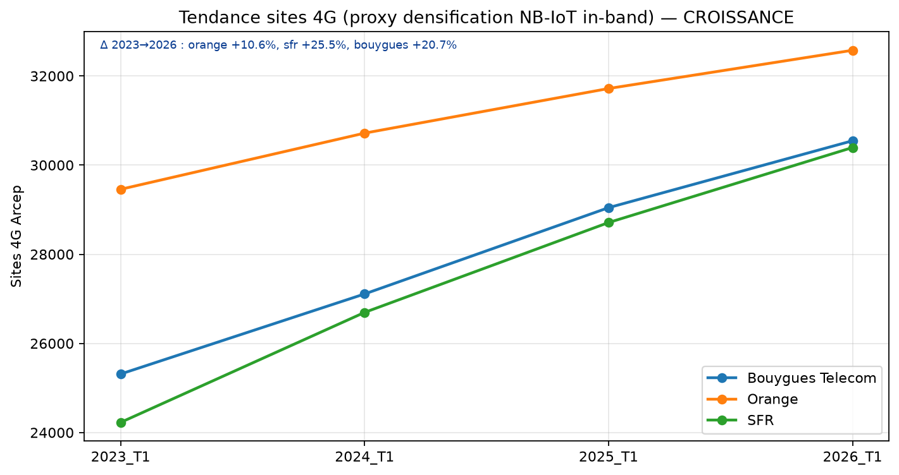
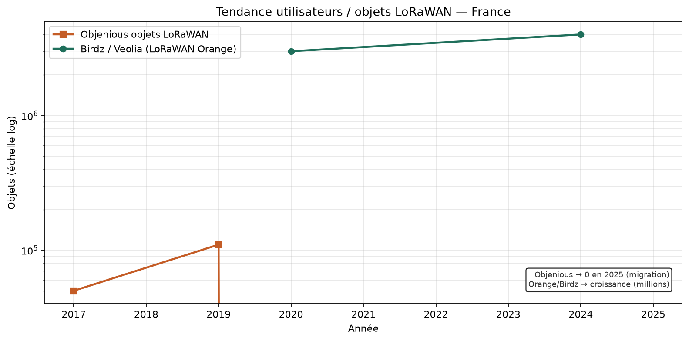

# Étude comparative — déploiement LoRaWAN vs NB-IoT en France

> Analyse quantitative et qualitative basée sur données open (APIs) et sources opérateurs / GSMA / IoT Analytics.
> Généré automatiquement — inputs: `{"packetbroker": true, "helium": true, "arcep": true, "timeseries": true}`.

## Verdict — croissance vs décroissance

Depuis fin 2024 : parc d'antennes LoRaWAN public en DÉCROISSANCE nette (-47.3% vs pic) après arrêt Objenious ; Orange reste le seul opérateur LoRaWAN national mais est aussi positionné NB-IoT (avec SFR et Bouygues). Les sites 4G (proxy NB-IoT) et les utilisateurs cellulaires LPWA sont en CROISSANCE ; les objets LoRaWAN Orange croissent encore (double digit YoY) malgré la contraction du réseau public concurrent.

### Antennes / infrastructure

- **LoRaWAN public** : DÉCROISSANCE — pic ~9100 antennes (2022) → ~4800 après arrêt Objenious (**-47.3%**).
- **NB-IoT (proxy sites 4G)** : CROISSANCE — Orange **+10.6%**, SFR **+25.5%**, Bouygues **+20.7%** (2023→2026).

### Utilisateurs / objets

- **LoRaWAN** : CROISSANCE sur le parc Orange (double digit YoY déclaré) et Birdz (millions
de compteurs). DÉCROISSANCE nette du parc Objenious LoRa (migration forcée
2024-2025). Au global public LoRaWAN France : transfert d'utilisateurs plus
que disparition (migration), mais perte d'un réseau concurrent.
- **NB-IoT / cellulaire LPWA** : CROISSANCE : Objenious vise majority cellulaire dès 2023 ; sunset 2G/3G
pousse les flottes M2M vers NB-IoT/LTE-M ; Massive IoT mondial ~500 M fin 2022
(Ericsson) et LPWAN mondial +26% CAGR vers 2027 (IoT Analytics).
- **Synthèse** : Antennes LoRaWAN publiques : ↓ (-47% en 2025). Utilisateurs LoRaWAN Orange : ↑.
Capacité/couverture NB-IoT (proxy 4G + déclarations) : ↑. Utilisateurs cellulaire
LPWA : ↑ (bascule Objenious + sunset 2G/3G).

- Opérateurs LoRaWAN public national : **1** (Orange).
- Opérateurs NB-IoT national : **3** (Orange ~98 %, SFR ~99 %, Bouygues ~99 %).

## Indicateurs clés (KPI)

| Technologie | Acteur | Indicateur | Valeur | Unité | Type | Source |
|---|---|---|---:|---|---|---|
| LoRaWAN | Orange (réseau opéré) | Antennes / gateways | 4800 | antennes | déclaratif | Orange Business |
| LoRaWAN | Orange (réseau opéré) | Couverture population | 95 | % | déclaratif | Orange Business |
| LoRaWAN | Orange (réseau opéré) | Communes couvertes | 30000 | communes | déclaratif | Orange Business |
| LoRaWAN | Orange (réseau opéré) | Croissance objets connectés | double_digit_yoy |  | tendance | Orange Business (JDN) |
| LoRaWAN | Communautaire (Packet Broker) | Gateways géolocalisés FR métropole | 2734 | gateways | mesuré_api | https://mapper.packetbroker.net/api/v2/gateways |
| LoRaWAN | Communautaire (Packet Broker) | Gateways online | 413 | gateways | mesuré_api | https://mapper.packetbroker.net/api/v2/gateways |
| LoRaWAN | Helium IoT | Hotspots estimés FR (échantillon) | 11869 | hotspots | estimé_api | https://entities.nft.helium.io/v2/hotspots |
| LoRaWAN | Objenious / Bouygues | Statut réseau | shutdown |  | fait | Objenious (arrêt 2024) |
| NB-IoT | Orange | Couverture population déclarée | 98 | % | déclaratif | GSMA / opérateurs / agrégats |
| NB-IoT | Orange | Positionnement FR | positioned_fr |  | qualitatif | GSMA / Live Objects / opérateurs |
| NB-IoT | SFR | Couverture population déclarée | 99 | % | déclaratif | GSMA / opérateurs / agrégats |
| NB-IoT | SFR | Positionnement FR | positioned_fr |  | qualitatif | GSMA / Live Objects / opérateurs |
| NB-IoT | Bouygues / Objenious | Couverture population déclarée | 99 | % | déclaratif | GSMA / opérateurs / agrégats |
| NB-IoT | Bouygues / Objenious | Positionnement FR | positioned_fr |  | qualitatif | GSMA / Live Objects / opérateurs |
| Cellulaire (proxy NB-IoT/LTE-M) | Orange | Sites 4G Arcep (2026_T1) | 32576 | sites | mesuré_open_data | Arcep Mon Réseau Mobile |
| Cellulaire (proxy NB-IoT/LTE-M) | SFR | Sites 4G Arcep (2026_T1) | 30394 | sites | mesuré_open_data | Arcep Mon Réseau Mobile |
| Cellulaire (proxy NB-IoT/LTE-M) | Bouygues Telecom | Sites 4G Arcep (2026_T1) | 30546 | sites | mesuré_open_data | Arcep Mon Réseau Mobile |
| Cellulaire (proxy NB-IoT/LTE-M) | Free Mobile | Sites 4G Arcep (2026_T1) | 30614 | sites | mesuré_open_data | Arcep Mon Réseau Mobile |
| LPWAN mondial | IoT Analytics | Connexions LPWAN 2023 | 1.3 | milliards | marché | IoT Analytics 2024 |
| LoRa (ex-Chine) | IoT Analytics | Part connexions LPWAN | 41 | % | marché | IoT Analytics 2024 |
| NB-IoT (ex-Chine) | IoT Analytics | Part connexions LPWAN | 20 | % | marché | IoT Analytics 2024 |

## Graphiques (tendances)










## Axes qualitatifs

### Spectre et modèle économique
- **LoRaWAN** : Bande libre EU868 — CAPEX gateway / OPEX opérateur public ou privé
- **NB-IoT** : Spectre licencié — s'appuie sur RAN 4G existant ; abonnement SIM opérateur

### Modèle de couverture
- **LoRaWAN** : Réseau dédié (Orange ~4800 GW) + communautaires + privés
- **NB-IoT** : Densification via sites LTE (in-band) — couverture population déclarée ~99% SFR/Bouygues

### Pénétration indoor / deep indoor
- **LoRaWAN** : Bonne outdoor ; indoor variable — nano-gateways / privés souvent nécessaires
- **NB-IoT** : MCL élevé (~164 dB) — avantage caves, compteurs, sous-sols

### Mobilité et roaming
- **LoRaWAN** : Roaming LoRaWAN Alliance / Packet Broker possible mais hétérogène
- **NB-IoT** : Roaming cellulaire standardisé (accords opérateurs / MVNO IoT)

### Autonomie énergétique
- **LoRaWAN** : Optimisé objets statiques très basse conso (avantage cité par Orange vs NB-IoT)
- **NB-IoT** : PSM / eDRX ; autonomie élevée mais souvent inférieure LoRaWAN class A pour cas ultra-basse conso

### Risque écosystème France
- **LoRaWAN** : Consolidation (Objenious off) ; Orange seul national public ; privés en hausse ; antennes publiques en baisse (-47%)
- **NB-IoT** : Trio Orange + SFR + Bouygues ; densification 4G en hausse ; aligné sunset 2G/3G

### Cas d'usage typiques FR
- **LoRaWAN** : Smart metering eau (Birdz/Veolia), smart city, agri, monitoring statique
- **NB-IoT** : Compteurs gaz/eau, tracking, alarmes, cas needing QoS opérateur / deep indoor

## Chronologie

| Date | Techno | Acteur | Événement | Type |
|---|---|---|---|---|
| 2015-09 | LoRaWAN | Orange | Annonce déploiement réseau national LoRa (pilote Grenoble) | launch |
| 2016-01 | LoRaWAN | Orange | Ouverture progressive du réseau LoRa national (Live Objects) | launch |
| 2016 | LoRaWAN | Objenious / Bouygues Telecom | Création Objenious — 1er réseau LoRaWAN opéré concurrent | launch |
| 2016-06 | NB-IoT | 3GPP | Standardisation NB-IoT (Release 13) | standard |
| 2018-2020 | LTE-M / NB-IoT | Orange / SFR / Bouygues | Déploiements progressifs LTE-M (Orange) et NB-IoT (SFR puis Bouygues) | rollout |
| 2022-01 | IoT stock | ADEME / Arcep | 244 millions d'objets connectés estimés en France | market |
| 2022-12 | NB-IoT / LTE-M | Bouygues Telecom / Objenious | Couverture nationale >99% population LTE-M et NB-IoT | coverage |
| 2023 | LPWAN market | IoT Analytics | 1,3 Md connexions LPWAN mondiales ; hors Chine LoRa ~41% vs NB-IoT ~20% | market |
| 2024-06 | LoRaWAN | Objenious | Annonce arrêt réseau LoRaWAN Objenious (bascule cellulaire IoT) | shutdown |
| 2024-12 | LoRaWAN | Objenious | Fermeture effective du réseau LoRaWAN Bouygues/Objenious | shutdown |
| 2024 | LoRaWAN | Orange | Engagement de continuité LoRaWAN a minima jusqu'au 31/12/2027 | commitment |
| 2025-2026 | 2G/3G sunset | Opérateurs FR | Arrêts 2G/3G planifiés → accélération migration IoT vers LTE-M / NB-IoT | migration |
| 2025-11 | NB-IoT / LTE-M | GSMA | 269 réseaux Mobile IoT mondiaux (140 NB-IoT, 129 LTE-M) — FR: Orange, SFR, Bouygues | market |

## Limites méthodologiques

- L'Arcep ne publie pas de couches NB-IoT / LTE-M / LoRaWAN : les % population sont déclaratifs.
- Les sites 4G sont un **proxy** de densification cellulaire (NB-IoT in-band), pas un inventaire d'antennes NB-IoT dédiées.
- Séries utilisateurs LoRaWAN partielles (Objenious, Birdz, déclarations Orange) — pas de recensement exhaustif Arcep.
- Packet Broker ne capture pas le réseau LoRaWAN Orange opéré (~4800 antennes).

## Reproductibilité

```bash
pip install -r requirements.txt
python -m scripts.run_study --collect --spatial --analyze --report
```
