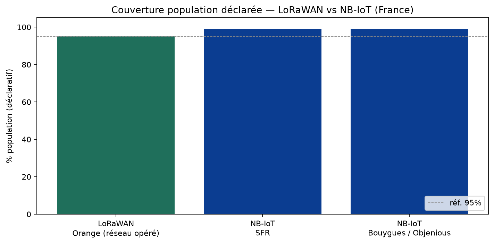
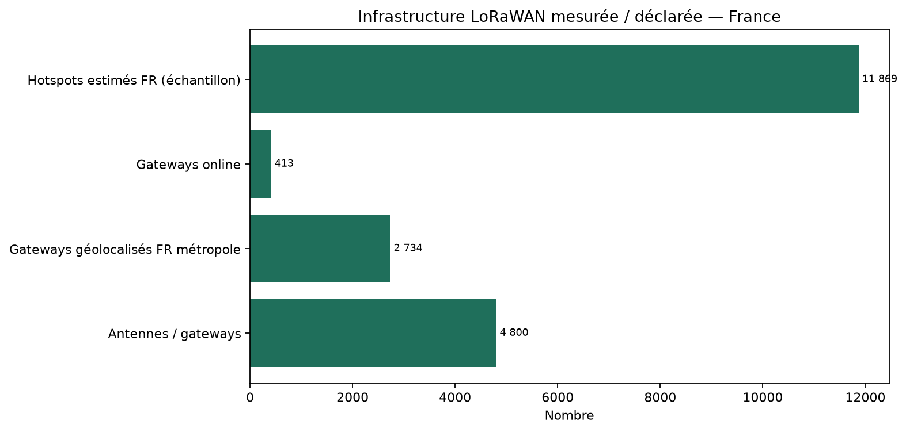
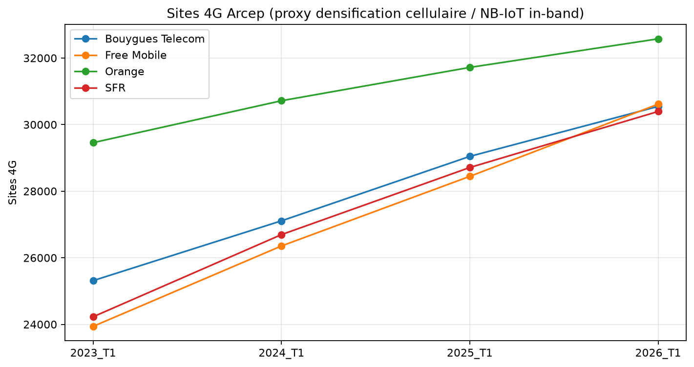
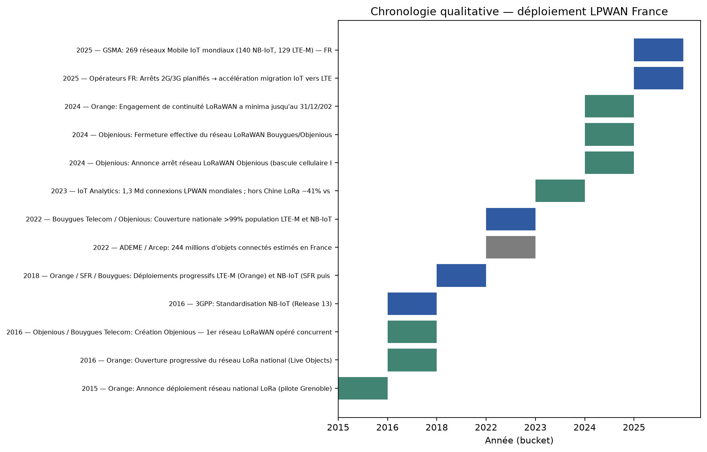

# Étude comparative — déploiement LoRaWAN vs NB-IoT en France

> Analyse quantitative et qualitative basée sur données open (APIs) et sources opérateurs / GSMA / IoT Analytics.
> Généré automatiquement — inputs: `{"packetbroker": true, "helium": true, "arcep": true}`.

## Verdict synthétique

Depuis fin 2024, le duopole LoRaWAN opéré (Orange/Objenious) est devenu un monopole public Orange, tandis que NB-IoT/LTE-M se déploie en multi-opérateurs cellulaires (SFR, Bouygues ; Orange sur LTE-M).

- **LoRaWAN public national** : 1 opérateur (Orange), ~4800 antennes, ~95 % population.
- **NB-IoT national** : 2 opérateurs (SFR ~99 %, Bouygues ~99 %) ; Orange non positionné en France (LTE-M + LoRaWAN).

## Indicateurs clés (KPI)

| Technologie | Acteur | Indicateur | Valeur | Unité | Type | Source |
|---|---|---|---:|---|---|---|
| LoRaWAN | Orange (réseau opéré) | Antennes / gateways | 4800 | antennes | déclaratif | Orange Business |
| LoRaWAN | Orange (réseau opéré) | Couverture population | 95 | % | déclaratif | Orange Business |
| LoRaWAN | Orange (réseau opéré) | Communes couvertes | 30000 | communes | déclaratif | Orange Business |
| LoRaWAN | Communautaire (Packet Broker) | Gateways géolocalisés FR métropole | 2734 | gateways | mesuré_api | https://mapper.packetbroker.net/api/v2/gateways |
| LoRaWAN | Communautaire (Packet Broker) | Gateways online | 413 | gateways | mesuré_api | https://mapper.packetbroker.net/api/v2/gateways |
| LoRaWAN | Helium IoT | Hotspots estimés FR (échantillon) | 11869 | hotspots | estimé_api | https://entities.nft.helium.io/v2/hotspots |
| LoRaWAN | Objenious / Bouygues | Statut réseau | shutdown |  | fait | Objenious (arrêt 2024) |
| NB-IoT | SFR | Couverture population déclarée | 99 | % | déclaratif | Opérateur / presse IoT |
| NB-IoT | Bouygues / Objenious | Couverture population déclarée | 99 | % | déclaratif | Opérateur / presse IoT |
| NB-IoT | Orange | Positionnement FR | not_positioned_fr |  | qualitatif | Orange Business (JDN) |
| Cellulaire (proxy NB-IoT/LTE-M) | Orange | Sites 4G Arcep (2026_T1) | 32576 | sites | mesuré_open_data | Arcep Mon Réseau Mobile |
| Cellulaire (proxy NB-IoT/LTE-M) | SFR | Sites 4G Arcep (2026_T1) | 30394 | sites | mesuré_open_data | Arcep Mon Réseau Mobile |
| Cellulaire (proxy NB-IoT/LTE-M) | Bouygues Telecom | Sites 4G Arcep (2026_T1) | 30546 | sites | mesuré_open_data | Arcep Mon Réseau Mobile |
| Cellulaire (proxy NB-IoT/LTE-M) | Free Mobile | Sites 4G Arcep (2026_T1) | 30614 | sites | mesuré_open_data | Arcep Mon Réseau Mobile |
| LPWAN mondial | IoT Analytics | Connexions LPWAN 2023 | 1.3 | milliards | marché | IoT Analytics 2024 |
| LoRa (ex-Chine) | IoT Analytics | Part connexions LPWAN | 41 | % | marché | IoT Analytics 2024 |
| NB-IoT (ex-Chine) | IoT Analytics | Part connexions LPWAN | 20 | % | marché | IoT Analytics 2024 |

## Graphiques










## Axes qualitatifs

### Spectre et modèle économique
- **LoRaWAN** : Bande libre EU868 — CAPEX gateway / OPEX opérateur public ou privé
- **NB-IoT** : Spectre licencié — s'appuie sur RAN 4G existant ; abonnement SIM opérateur

### Modèle de couverture
- **LoRaWAN** : Réseau dédié (Orange ~4800 GW) + communautaires + privés
- **NB-IoT** : Densification via sites LTE (in-band) — couverture population déclarée ~99% SFR/Bouygues

### Pénétration indoor / deep indoor
- **LoRaWAN** : Bonne outdoor ; indoor variable — nano-gateways / privés souvent nécessaires
- **NB-IoT** : MCL élevé (~164 dB) — avantage caves, compteurs, sous-sols

### Mobilité et roaming
- **LoRaWAN** : Roaming LoRaWAN Alliance / Packet Broker possible mais hétérogène
- **NB-IoT** : Roaming cellulaire standardisé (accords opérateurs / MVNO IoT)

### Autonomie énergétique
- **LoRaWAN** : Optimisé objets statiques très basse conso (avantage cité par Orange vs NB-IoT)
- **NB-IoT** : PSM / eDRX ; autonomie élevée mais souvent inférieure LoRaWAN class A pour cas ultra-basse conso

### Risque écosystème France
- **LoRaWAN** : Consolidation opérateur (Objenious off) ; Orange seul national public ; privés en hausse
- **NB-IoT** : Dualité SFR + Bouygues ; aligné sunset 2G/3G et roadmap 3GPP (NB-IoT 2.0)

### Cas d'usage typiques FR
- **LoRaWAN** : Smart metering eau (Birdz/Veolia), smart city, agri, monitoring statique
- **NB-IoT** : Compteurs gaz/eau, tracking, alarmes, cas needing QoS opérateur / deep indoor

## Chronologie

| Date | Techno | Acteur | Événement | Type |
|---|---|---|---|---|
| 2015-09 | LoRaWAN | Orange | Annonce déploiement réseau national LoRa (pilote Grenoble) | launch |
| 2016-01 | LoRaWAN | Orange | Ouverture progressive du réseau LoRa national (Live Objects) | launch |
| 2016 | LoRaWAN | Objenious / Bouygues Telecom | Création Objenious — 1er réseau LoRaWAN opéré concurrent | launch |
| 2016-06 | NB-IoT | 3GPP | Standardisation NB-IoT (Release 13) | standard |
| 2018-2020 | LTE-M / NB-IoT | Orange / SFR / Bouygues | Déploiements progressifs LTE-M (Orange) et NB-IoT (SFR puis Bouygues) | rollout |
| 2022-01 | IoT stock | ADEME / Arcep | 244 millions d'objets connectés estimés en France | market |
| 2022-12 | NB-IoT / LTE-M | Bouygues Telecom / Objenious | Couverture nationale >99% population LTE-M et NB-IoT | coverage |
| 2023 | LPWAN market | IoT Analytics | 1,3 Md connexions LPWAN mondiales ; hors Chine LoRa ~41% vs NB-IoT ~20% | market |
| 2024-06 | LoRaWAN | Objenious | Annonce arrêt réseau LoRaWAN Objenious (bascule cellulaire IoT) | shutdown |
| 2024-12 | LoRaWAN | Objenious | Fermeture effective du réseau LoRaWAN Bouygues/Objenious | shutdown |
| 2024 | LoRaWAN | Orange | Engagement de continuité LoRaWAN a minima jusqu'au 31/12/2027 | commitment |
| 2025-2026 | 2G/3G sunset | Opérateurs FR | Arrêts 2G/3G planifiés → accélération migration IoT vers LTE-M / NB-IoT | migration |
| 2025-11 | NB-IoT / LTE-M | GSMA | 269 réseaux Mobile IoT mondiaux (140 NB-IoT, 129 LTE-M) — FR: Orange, SFR, Bouygues | market |

## Limites méthodologiques

- L'Arcep ne publie pas (encore) de couches open data NB-IoT / LTE-M / LoRaWAN.
- Les % population opérateurs sont déclaratifs ; les mesures Packet Broker / Helium / Arcep 4G sont objectives mais partielles.
- Packet Broker ne capture pas le réseau LoRaWAN privé Orange (~4800 antennes).
- Helium : estimation par échantillonnage ; coordonnées obfuscées ; statut `is_active` peu fiable hors contexte epoch.
- Orange NB-IoT : divergences possibles entre listing GSMA et déclaration Orange Business — documentées dans `data/curated/`.

## Reproductibilité

```bash
pip install -r requirements.txt
python -m scripts.run_study --collect --analyze --report
```
