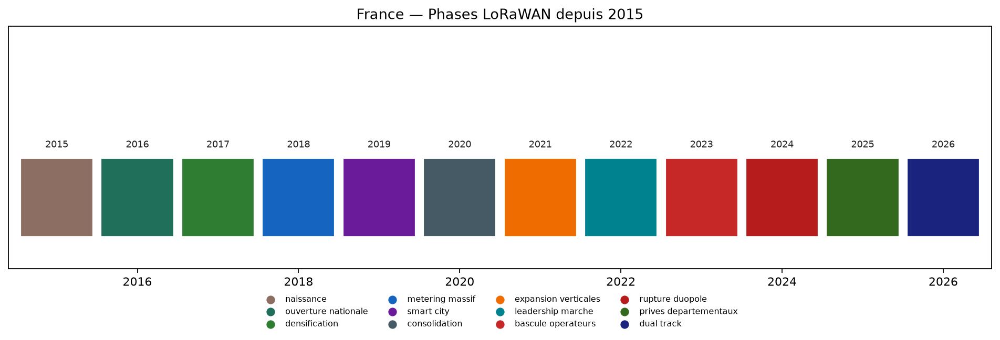
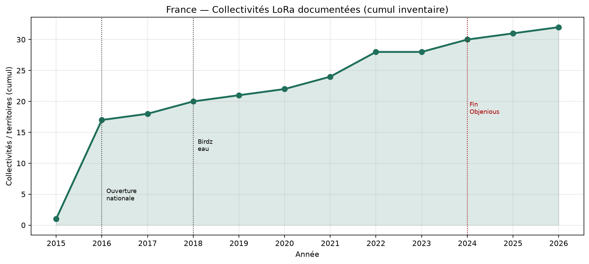
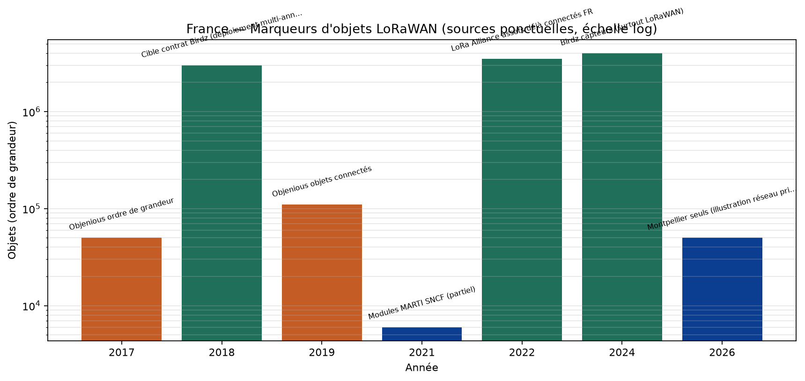
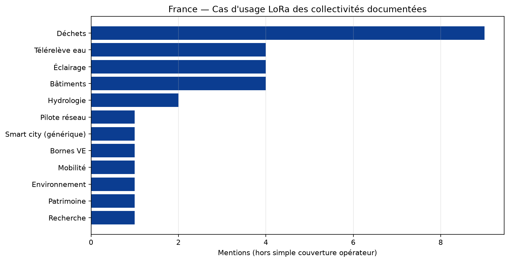
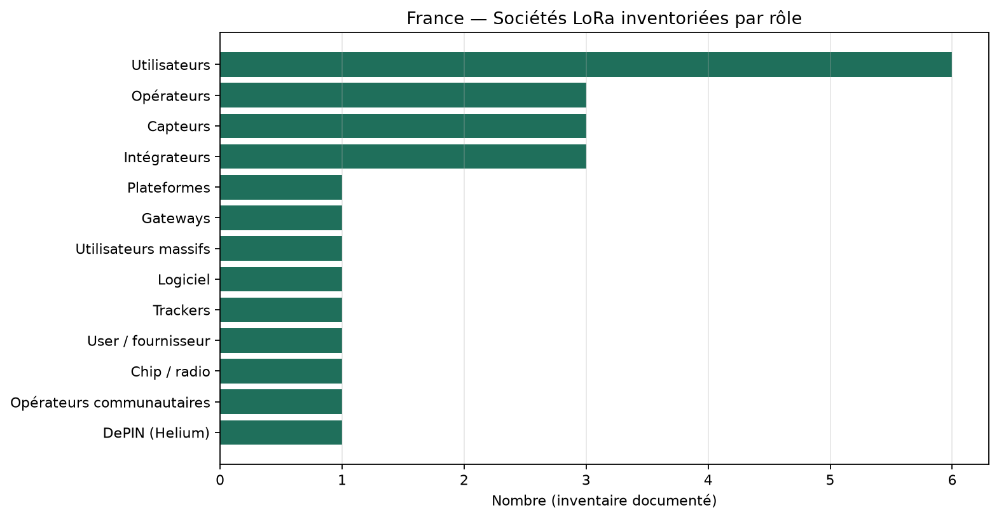

# Usagers LoRa / LoRaWAN en France — communes, villes, sociétés

Pas de registre national Arcep des projets LoRaWAN. Cet inventaire compile
des collectivités et sociétés nommément citées dans des sources publiques.
La couverture Orange/Objenious (~30 000 communes) ≠ 30 000 projets smart city.

## Tendances depuis 2015

- 2015–2017 : naissance et couverture nationale (Orange + Objenious)
- 2018–2022 : explosion des objets via télérelève eau (Birdz) + smart city
- 2023–2024 : fin du duopole public ; migration Objenious ; Netmore entre
- 2025–2026 : antennes publiques ↓ mais objets et réseaux privés collectivités ↑

### Chronologie

- **2015** (naissance) — Pilote Orange Grenoble
- **2016** (ouverture nationale) — Orange 17 zones ; création Objenious ; débuts Strasbourg/Montpellier privés
- **2017** (densification) — Objenious ~4020 antennes, 93% pop., dizaines de milliers d'objets, >40 clients
- **2018** (metering massif) — Birdz/Veolia choisit Orange ; cible >3 M compteurs ; Bordeaux privé ; SNCF
- **2019** (smart city) — Objenious ~100-120k objets ; Dijon parking ; Bordeaux extension
- **2020** (consolidation) — Isère départemental ; Helium ouverture FR
- **2021** (expansion verticales) — SNCF 500 GW + 6k MARTI ; Heyliot déchets ; Helium FR monte
- **2022** (leadership marche) — LoRa Alliance : >3,5 M assets FR + 1,5 M en déploiement ; 64% nouveaux projets IoT FR
- **2023** (bascule operateurs) — Netmore reprend Objenious LoRaWAN ; clients cellulaire LPWA ↑
- **2024** (rupture duopole) — Arrêt Objenious LoRa ; Berry Territoire Innovant ; Birdz >4 M capteurs
- **2025** (prives departementaux) — Orange seul MNO LoRa national ; Isère/Somme/Berry accélèrent
- **2026** (dual track) — Montpellier 50k objets privés ; Orange public + privés + Netmore + Helium ~3k

## Collectivités / villes documentées

| Collectivité | Type | Début | Cas d'usage | Réseau | Objets (approx.) |
|---|---|---:|---|---|---:|
| Grenoble | ville | 2015 | pilote_reseau, smart_city | orange_public | — |
| Angers | ville | 2016 | couverture_operateur | orange_public | — |
| Avignon | ville | 2016 | couverture_operateur | orange_public | — |
| Bordeaux | metropole | 2016 | couverture_operateur, eclairage, dechets, bornes_ve | mixte | — |
| Lille | ville | 2016 | couverture_operateur | orange_public | — |
| Lyon | ville | 2016 | couverture_operateur | orange_public | — |
| Marseille | ville | 2016 | couverture_operateur | orange_public | — |
| Montpellier Méditerranée Métropole | metropole | 2016 | teleleve_eau, dechets, hydrologie, air | prive | 50 000 |
| Nantes | ville | 2016 | couverture_operateur | orange_public | — |
| Nice | ville | 2016 | couverture_operateur | orange_public | — |
| Paris | ville | 2016 | couverture_operateur | orange_public | — |
| Rennes | ville | 2016 | couverture_operateur | orange_public | — |
| Rouen | ville | 2016 | couverture_operateur | orange_public | — |
| Strasbourg | eurometropole | 2016 | mobilite, environnement, patrimoine, recherche | prive_experimental | — |
| Toulon | ville | 2016 | couverture_operateur | orange_public | — |
| Toulouse | ville | 2016 | couverture_operateur, teleleve_eau | orange_public | — |
| Dijon Métropole | metropole | 2019 | stationnement | public_ou_integre | 450 |
| Département de l'Isère | departement | 2020 | batiments, teleleve_eau, dechets, eclairage | prive_departemental | — |
| Communauté de communes Pays du Mont-Blanc | intercommunalite | 2021 | dechets | mixte | 1 500 |
| Communauté d'agglomération de Lens-Liévin | agglomeration | 2022 | dechets | mixte | 300 |
| Communauté d'agglomération du Niortais | agglomeration | 2022 | dechets | mixte | 720 |
| Istres | ville | 2022 | eclairage, qualite_air, ecoles | prive | — |
| Pays de Montbéliard Agglomération | agglomeration | 2022 | dechets | mixte | 1 445 |
| Saint-Malo Agglomération | agglomeration | 2022 | dechets | mixte | 457 |
| Département de la Somme | departement | 2024 | eclairage, dechets, batiments, hydrologie | prive_departemental | — |
| Indre (36) + Cher (18) — Berry Territoire Innovant | departements | 2024 | teleleve_eau, batiments, frequentation | prive_mutualise | — |

> Zones d'ouverture Orange 2016 : Angers, Avignon, Bordeaux, Douai/Lens, Grenoble, Lille, Lyon, Marseille, Montpellier, Nantes, Nice, Paris, Rennes, Rouen, Toulon, Toulouse, Strasbourg.

## Sociétés

| Société | Rôle | Verticale | Début | Note |
|---|---|---|---:|---|
| Semtech / Cycleo | vendor_chip | radio | 2009 | Origine techno LoRa (Grenoble) ; Semtech acquis Cycleo |
| Actility | vendor_plateforme | coeur_reseau | 2015 | ThingPark ; co-auteur LoRaWAN ; acquis par Netmore (2026) |
| Kerlink | vendor_gateways | infrastructure | 2015 | Gateways Wirnet ; fondateur LoRa Alliance ; Rennes |
| Orange / Orange Business | operateur | reseau_public | 2015 | ~4800 antennes ; engagement LoRaWAN ≥ 31/12/2027 |
| Adeunis | vendor_capteurs | batiment_industrie | 2016 | Crolles (Isère) |
| Objenious (Bouygues Telecom) | operateur | reseau_public | 2016–2024 | Arrêt commercial LoRaWAN fin 2024 ; pivot NB-IoT/LTE-M |
| Abeeway (Actility) | vendor_trackers | tracking | 2017 |  |
| Carrefour | utilisateur | retail_logistique | 2017 | Localisation rolls sur Objenious |
| Colas | utilisateur | btp_flottes | 2017 | Tracking camions Objenious |
| Birdz (Veolia / Nova Veolia) | utilisateur_massif | teleleve_eau | 2018 | Cible >3 M compteurs eau LoRaWAN Orange ; >4 M capteurs cités 2024 |
| Pilot Things | vendor_logiciel | supervision | 2018 |  |
| SNCF | utilisateur | ferroviaire | 2018 | Réseau LoRaWAN privé ; 500 GW + 6000 modules MARTI (2021) |
| SPIE ICS | integrateur | smart_city | 2018 | Pilote Bordeaux Métropole |
| The Things Industries / TTN | operateur_communautaire | reseau_communautaire | 2018 | Communautés FR (Packet Broker) |
| Veolia | utilisateur | teleleve_eau | 2018 | Via Birdz |
| Onesitu | vendor_capteurs | stationnement | 2019 |  |
| Synox | integrateur | smart_city | 2019 | Dijon parking ; Montpellier |
| BH Technologies | utilisateur_fournisseur | dechets | 2020 |  |
| Helium / Nova Labs | reseau_depin | reseau_communautaire | 2020 | ~2600 hotspots FR en 2022 → ~3200 réseau estimé 2026 |
| Invoxia | utilisateur | tracking | 2020 |  |
| Heyliot | vendor_capteurs | dechets | 2021 | Heywaste ; nombreuses collectivités |
| Roole | utilisateur | assurance_auto | 2021 | Anti-vol Wetrak (Abeeway + Orange) |
| Netmore Group | operateur | reseau_public | 2023 | Reprise actifs LoRaWAN Objenious (nov. 2023) |
| Ubicité | integrateur | territoires | 2024 | Berry Territoire Innovant (Indre–Cher) |

## Graphiques

## Limites

- Inventaire **non exhaustif** (presse / CP / REX).
- « 30 000 communes couvertes » = éligibilité radio, pas 30 000 projets.
- Les volumes d'objets sont des **marqueurs sourcés** (pas une série homogène).
