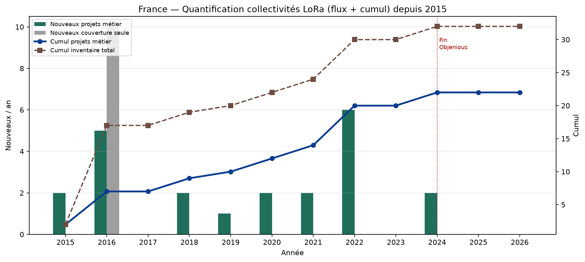
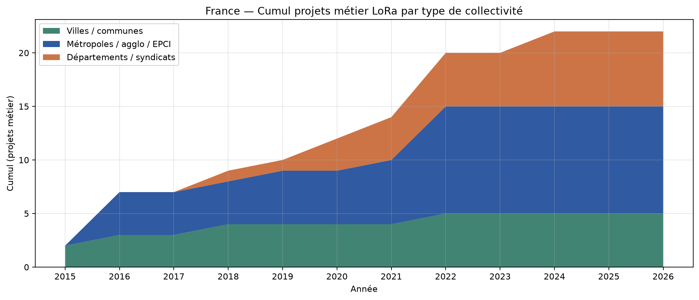
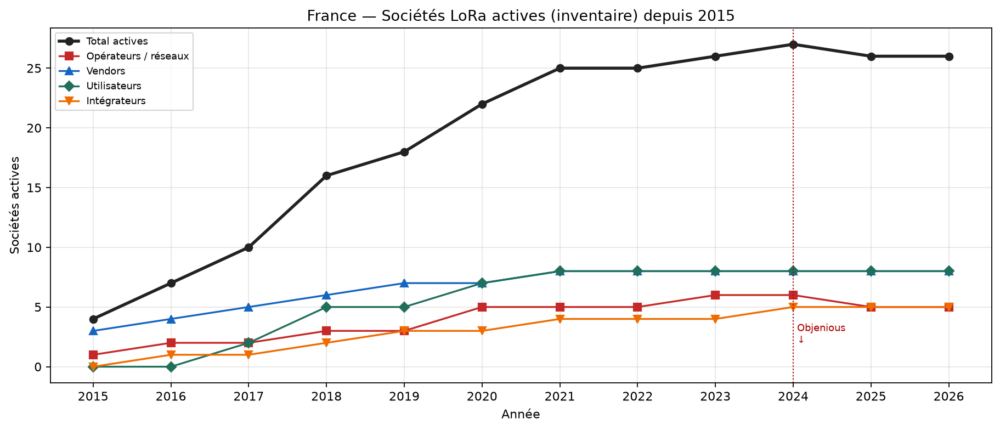
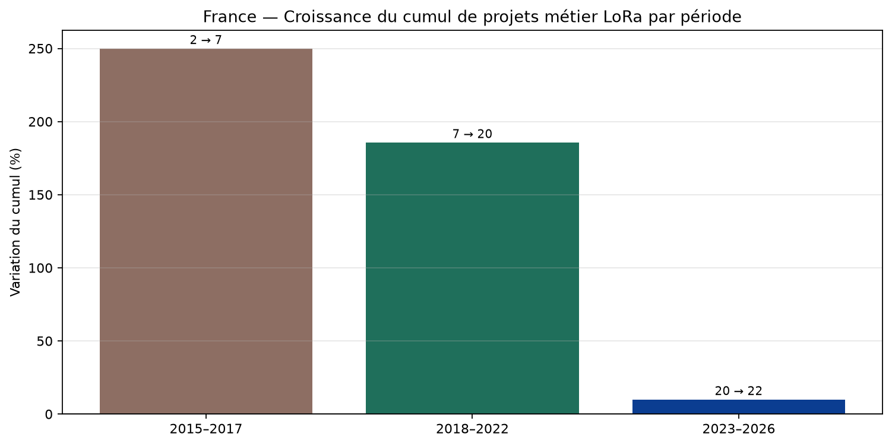
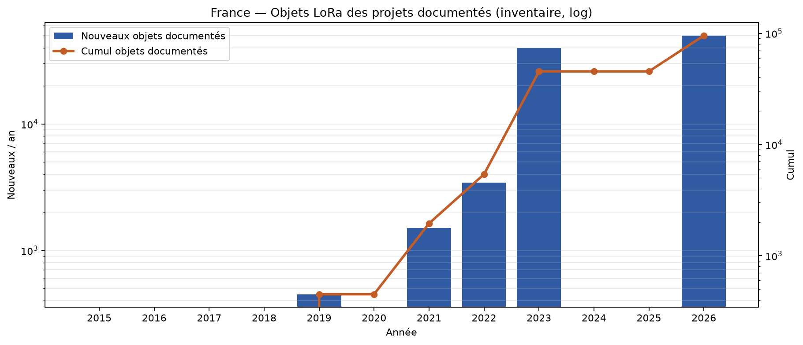
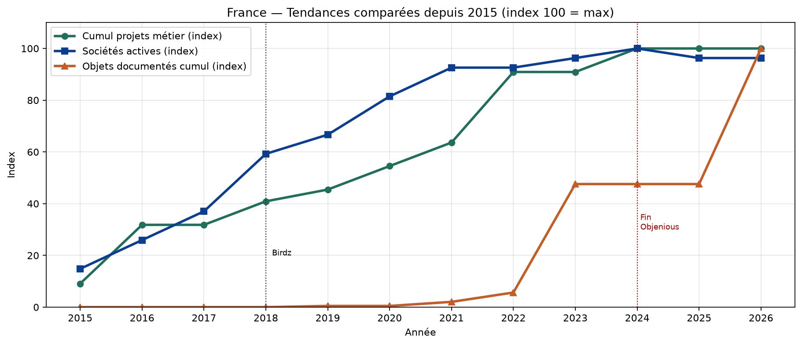

# Quantification LoRa France — collectivités, villes, sociétés depuis 2015

Pas de registre national Arcep des projets LoRaWAN. Quantification = (A) inventaire nominatif sourcé (flux/cumul calculés) ; (B) marqueurs opérateurs/alliance. Séparer couverture radio (~30 000 communes) et projets métier documentés. Le claim « 500 collectivités (2021) » est un marqueur secondaire à faible confiance.

## Synthèse chiffrée (inventaire)

- Collectivités inventoriées : **32**
- dont projets métier : **22**
- dont couverture opérateur seule : **10**
- Sociétés inventoriées : **27**
- Objets documentés (somme des projets ayant un chiffre) : **95 395**

## Tendances (croissance du cumul projets métier)

| Période | Début | Fin | Variation | Lecture |
|---|---:|---:|---:|---|
| 2015–2017 | 2 | 7 | **250.0%** | Amorçage + ouverture nationale ; peu de projets métier hors pilotes/grandes villes |
| 2018–2022 | 7 | 20 | **185.7%** | CROISSANCE forte : eau, smart city, départements (Sarthe, Finistère), déchets |
| 2023–2026 | 20 | 22 | **10.0%** | CROISSANCE continue des projets métier privés malgré fin Objenious |

## Tableau annuel quantifié

| Année | + inventaire | + projets métier | Cumul métier | Croissance cumul métier | Cumul inventaire | Sociétés actives | Objets doc. cumul |
|---:|---:|---:|---:|---:|---:|---:|---:|
| 2015 | 2 | 2 | 2 | — | 2 | 4 | 0 |
| 2016 | 15 | 5 | 7 | 250.0% | 17 | 7 | 0 |
| 2017 | 0 | 0 | 7 | 0.0% | 17 | 10 | 0 |
| 2018 | 2 | 2 | 9 | 28.6% | 19 | 16 | 0 |
| 2019 | 1 | 1 | 10 | 11.1% | 20 | 18 | 450 |
| 2020 | 2 | 2 | 12 | 20.0% | 22 | 22 | 450 |
| 2021 | 2 | 2 | 14 | 16.7% | 24 | 25 | 1 950 |
| 2022 | 6 | 6 | 20 | 42.9% | 30 | 25 | 5 395 |
| 2023 | 0 | 0 | 20 | 0.0% | 30 | 26 | 45 395 |
| 2024 | 2 | 2 | 22 | 10.0% | 32 | 27 | 45 395 |
| 2025 | 0 | 0 | 22 | 0.0% | 32 | 26 | 45 395 |
| 2026 | 0 | 0 | 22 | 0.0% | 32 | 26 | 95 395 |

### Lecture

- 2015–2017 : naissance puis couverture nationale (Orange + Objenious) — peu de projets métier documentés hors pilotes
- 2018–2022 : CROISSANCE forte des projets métier (eau, smart city, départements) et des objets (Birdz / Alliance)
- 2023–2024 : rupture opérateurs publics (Objenious↓) mais CROISSANCE des réseaux privés mutualisés
- 2025–2026 : dual track — opérateurs nationaux stabilisés + collectivités/départements en densification

## Marqueurs externes (hors inventaire nominatif)

| Année | Métrique | Valeur | Confiance |
|---:|---|---:|---|
| 2016 | zones_ouverture_orange | 17 | high |
| 2017 | communes_couvertes_objenious | 30 000 | high |
| 2017 | clients_objenious | 40 | medium |
| 2018 | communes_couvertes_orange | 30 000 | high |
| 2021 | collectivites_claim_arcep_secondaire | 500 | low |
| 2022 | assets_lora_alliance_fr | 3 500 000 | medium |
| 2024 | birdz_capteurs | 4 000 000 | medium |

## Graphiques

## Collectivités (projets métier)

| Collectivité | Type | Début | Objets |
|---|---|---:|---:|
| Grenoble | ville | 2015 | — |
| Saint-Sulpice-la-Forêt | commune | 2015 | — |
| Bordeaux | metropole | 2016 | — |
| Montpellier Méditerranée Métropole | metropole | 2016 | 50 000 |
| Rennes Métropole | metropole | 2016 | — |
| Strasbourg | eurometropole | 2016 | — |
| Toulouse | ville | 2016 | — |
| Issy-les-Moulineaux | ville | 2018 | — |
| Val d'Oise Numérique / Essonne Numérique / Seine-et-Marne Numérique | syndicats_mixtes | 2018 | — |
| Dijon Métropole | metropole | 2019 | 450 |
| Département de l'Isère | departement | 2020 | — |
| Sarthe (Sarthe Numérique) | departement | 2020 | 40 000 |
| Communauté de communes Pays du Mont-Blanc | intercommunalite | 2021 | 1 500 |
| Finistère (SDEF — Finistère Smart Connect) | departement | 2021 | — |
| Communauté d'agglomération de Lens-Liévin | agglomeration | 2022 | 300 |
| Communauté d'agglomération du Niortais | agglomeration | 2022 | 720 |
| Istres | ville | 2022 | — |
| Pays de Montbéliard Agglomération | agglomeration | 2022 | 1 445 |
| SMICOTOM Médoc | syndicat | 2022 | 523 |
| Saint-Malo Agglomération | agglomeration | 2022 | 457 |
| Département de la Somme | departement | 2024 | — |
| Indre (36) + Cher (18) — Berry Territoire Innovant | departements | 2024 | — |

## Sociétés

| Société | Rôle | Début | Fin |
|---|---|---:|---:|
| Semtech / Cycleo | vendor_chip | 2009 | — |
| Actility | vendor_plateforme | 2015 | — |
| Kerlink | vendor_gateways | 2015 | — |
| Orange / Orange Business | operateur | 2015 | — |
| Adeunis | vendor_capteurs | 2016 | — |
| Objenious (Bouygues Telecom) | operateur | 2016 | 2024 |
| Wi6labs | integrateur | 2016 | — |
| Abeeway (Actility) | vendor_trackers | 2017 | — |
| Carrefour | utilisateur | 2017 | — |
| Colas | utilisateur | 2017 | — |
| Birdz (Veolia / Nova Veolia) | utilisateur_massif | 2018 | — |
| Pilot Things | vendor_logiciel | 2018 | — |
| SNCF | utilisateur | 2018 | — |
| SPIE ICS | integrateur | 2018 | — |
| The Things Industries / TTN | operateur_communautaire | 2018 | — |
| Veolia | utilisateur | 2018 | — |
| Onesitu | vendor_capteurs | 2019 | — |
| Synox | integrateur | 2019 | — |
| BH Technologies | utilisateur_fournisseur | 2020 | — |
| Helium / Nova Labs | reseau_depin | 2020 | — |
| Invoxia | utilisateur | 2020 | — |
| Sartel THD | operateur_dsp | 2020 | — |
| Eiffage Énergie Systèmes | integrateur | 2021 | — |
| Heyliot | vendor_capteurs | 2021 | — |
| Roole | utilisateur | 2021 | — |
| Netmore Group | operateur | 2023 | — |
| Ubicité | integrateur | 2024 | — |

## Limites

- Inventaire **non exhaustif** : la croissance mesurée est celle de l’échantillon documenté.
- Couverture radio (~30 000 communes) ≠ projets métier.
- Claim « 500 collectivités (2021) » : marqueur secondaire à **faible confiance**.
- Objets documentés = somme des projets ayant publié un chiffre (sous-estime le parc réel).
