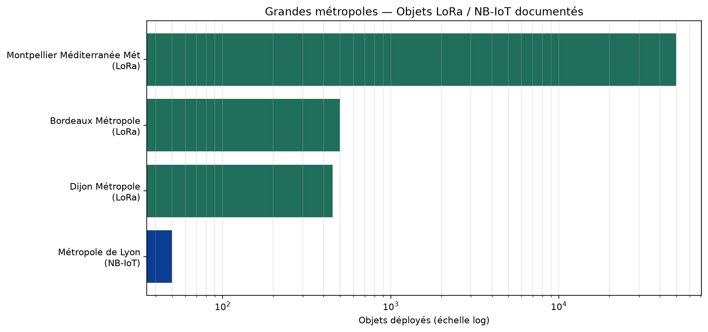
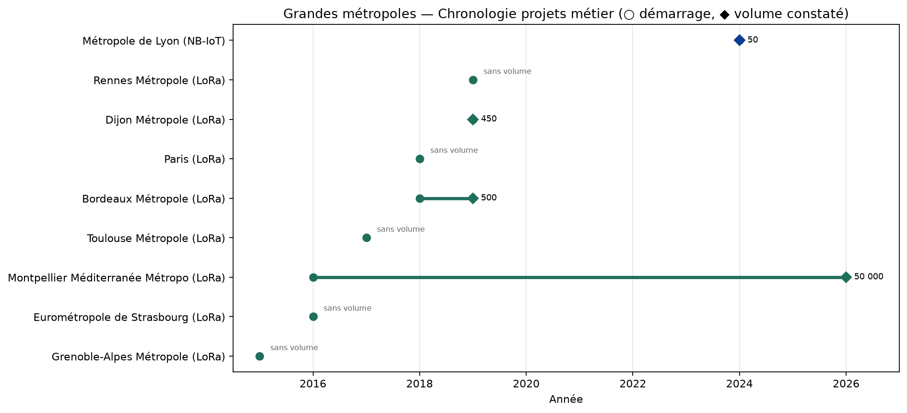

# Grandes métropoles — projets métier LoRa vs NB-IoT

Ne confondre pas couverture radio Orange/Objenious dans une métropole
(éligibilité) et projet métier documenté. Objets = chiffre publié ;
« — » = projet réel sans volume public.

## Tableau (métropoles avec projet métier documenté)

| Métropole | Techno | Début | Objets | Détail objets | Statut |
|---|---|---:|---:|---|---|
| Montpellier Méditerranée Métropole | LoRa | 2016 | 50 000 | ~45 000 télérelève eau ; reste déchets/hydrologie/air/écoles | confirme |
| Bordeaux Métropole | LoRa | 2018 | 500 | Pilote quartier Matmut Atlantique puis extension (~500 capteurs) | confirme |
| Dijon Métropole | LoRa | 2019 | 450 | Capteurs stationnement Os300 (Onesitu/Synox) | confirme |
| Métropole de Lyon | NB-IoT | 2024 | 50 | Valises Mobil'Eau pro migrées 2G→NB-IoT (dizaines — ordre de grandeur ~50). Data | partiel_confirme |
| Eurométropole de Strasbourg | LoRa | 2016 | — | Réseau expérimental/production (Inetlab) ; volume non publié | confirme_sans_volume |
| Grenoble-Alpes Métropole / Grenoble | LoRa | 2015 | — | Pilote national Orange LoRa (mai 2015) ; volume objets non publié | confirme_sans_volume |
| Paris / Île-de-France (syndicats — proxy Grand Paris) | LoRa | 2018 | — | Réseau privé régional Val d'Oise/Essonne/77 ; cible ~3000 GW début 2027 ; objets | infra_en_cours |
| Rennes Métropole | LoRa | 2019 | — | Réseau privé Wi6labs (43 communes) ; volume objets non publié | confirme_sans_volume |
| Toulouse Métropole | LoRa | 2017 | — | POC Birdz/Veolia télérelève eau sur Orange LoRaWAN ; volume local non isolé | confirme_sans_volume |

## Métropoles sans projet métier documenté (dans nos sources)

- Métropole d'Aix-Marseille-Provence
- Lille Métropole (MEL)
- Nantes Métropole
- Nice Côte d'Azur
- Rouen Normandie
- Toulon Provence Méditerranée
- Saint-Étienne Métropole
- Metz / Nancy / Clermont / Tours / Orléans / Brest

## Tendances

- 2015–2017 : amorçage LoRa dans quelques métropoles (Grenoble, Montpellier, Strasbourg, Toulouse)
- 2018–2019 : projets métier LoRa (Bordeaux, Rennes, Dijon) ; volumes encore modestes hors Montpellier
- 2020–2023 : peu de nouveaux projets métier métropolitains documentés ; densification Montpellier
- 2024–2026 : Lyon bascule partiellement NB-IoT (Mobil'Eau) ; Montpellier atteint 50k LoRa ; Grand Paris/IDF en déploiement infra

Sur les grandes métropoles, LoRa domine clairement les projets métier documentés.
NB-IoT n'apparaît de façon crédible qu'à Lyon (volume faible / partiel).

## Graphiques

