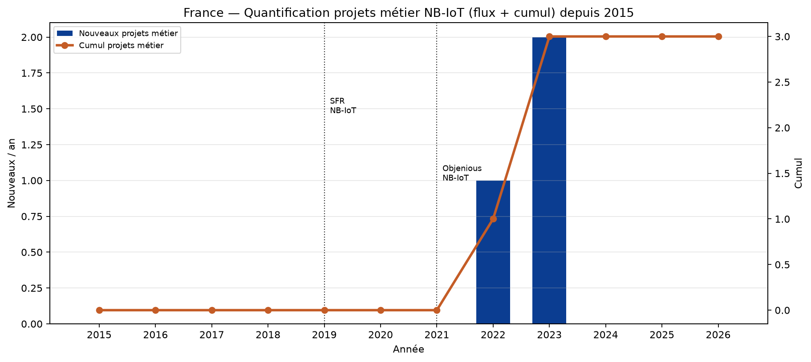
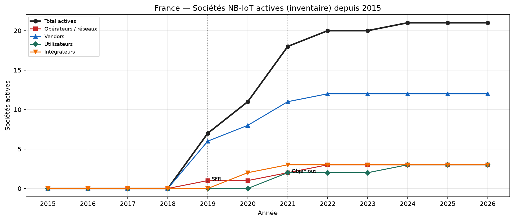
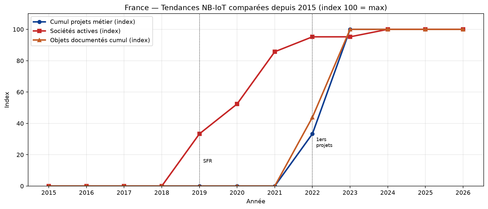
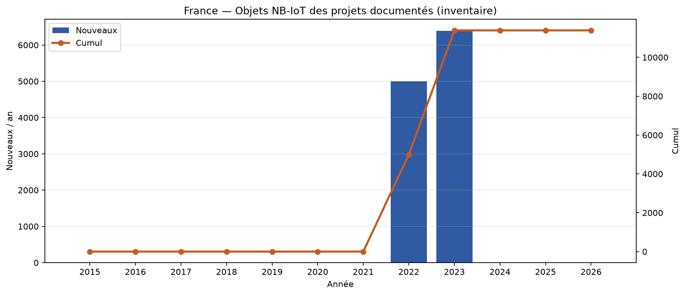
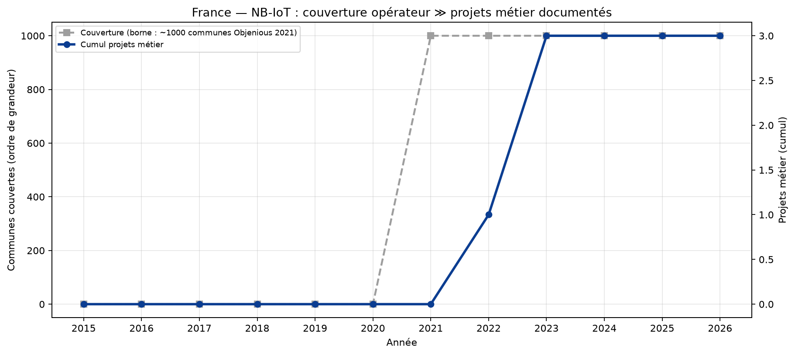
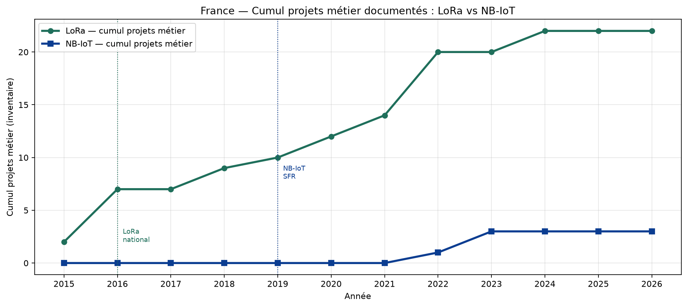

# Quantification NB-IoT France — projets métier depuis 2015

NB-IoT est in-band sur 4G : « communes couvertes » ≠ projets métier.
Inventaire collectivités NB-IoT nettement plus mince que LoRaWAN
(télérelève eau FR = surtout LoRa/Birdz ; gaz = Wize, pas NB-IoT).
Quantification = inventaire nominatif sourcé + marqueurs opérateurs.

## Synthèse chiffrée (inventaire)

- Collectivités nommées : **2**
- Projets métier (total) : **3** (dont 2 collectivités + 1 anonyme)
- Sociétés inventoriées : **21**
- Objets documentés (somme projets chiffrés) : **5 390**

### Faits nationaux

- SFR : 1er NB-IoT commercial France (fév. 2019)
- Bouygues/Objenious : NB-IoT nov. 2021 (~1000 communes) puis ≥99% pop. fin 2022
- Orange : listé NB-IoT (GSMA/Live Objects) ; stratégie historique aussi LTE-M + LoRa — nuance à conserver
- Gazpar GRDF = Wize 169 MHz (contre-exemple, pas NB-IoT)
- Extinction 2G/3G accélère migrations M2M vers LTE-M/NB-IoT

## Tendances

- 2015–2018 : pas de NB-IoT commercial FR (0 projet métier) — Orange LTE-M 2018
- 2019–2021 : naissance écosystème (SFR puis Objenious) ; vendors/intégrateurs ↑ ; projets métier encore rares
- 2022–2023 : premiers projets métier eau (fuites) documentés ; couverture nationale densifiée
- 2024–2026 : bascule LoRa Objenious → cellulaire ; annonces massives (Suez) mais inventaire collectivités toujours mince vs LoRa

## Croissance par période

| Période | Début | Fin | Variation | Lecture |
|---|---:|---:|---|---|
| 2015–2018 | 0 | 0 | — | NÉANT commercial NB-IoT FR — 0 projet métier inventorié |
| 2019–2021 | 0 | 0 | — | Lancement opérateurs (SFR, Objenious) ; écosystème sociétés ↑ ; projets métier encore 0 |
| 2022–2026 | 0 | 3 | — | Passage de 0 → 3 projets métier documentés (eau/fuites) alors que la couverture opérateur est déjà nationale |

## Tableau annuel quantifié

| Année | + projets métier | Cumul métier | Sociétés actives | Objets doc. cumul |
|---:|---:|---:|---:|---:|
| 2015 | 0 | 0 | 0 | 0 |
| 2016 | 0 | 0 | 0 | 0 |
| 2017 | 0 | 0 | 0 | 0 |
| 2018 | 0 | 0 | 0 | 0 |
| 2019 | 0 | 0 | 7 | 0 |
| 2020 | 0 | 0 | 11 | 0 |
| 2021 | 0 | 0 | 18 | 0 |
| 2022 | 1 | 1 | 20 | 5 000 |
| 2023 | 2 | 3 | 20 | 5 390 |
| 2024 | 0 | 3 | 21 | 5 390 |
| 2025 | 0 | 3 | 21 | 5 390 |
| 2026 | 0 | 3 | 21 | 5 390 |

## Projets métier documentés

| Projet / collectivité | Type | Début | Objets | Confiance |
|---|---|---:|---:|---|
| Montluçon Communauté | agglomeration | 2023 | 390 | high |
| Métropole de Lyon / Eau du Grand Lyon | metropole | 2023 | — | low |
| SFR × Gutermann — détection fuites (collectivité non nommée) | projet_anonyme | 2022 | 5 000 | medium |

## Sociétés

| Société | Rôle | Début | Note |
|---|---|---:|---|
| Gutermann | vendor_devices | 2019 | Zonescan NB-IoT ; partenariats SFR / Lyon |
| Orange Live Objects | vendor_plateforme | 2019 | Plateforme multi-connectivité ; packagée avec Adeunis ZEN |
| Quectel | vendor_modules | 2019 | Modules NB-IoT intégrés dans devices FR |
| SFR Business | operateur | 2019 | 1er NB-IoT commercial France |
| Sequans Communications | vendor_modules | 2019 | Siège Colombes ; chips LTE-M/NB-IoT |
| Vertical M2M | vendor_plateforme | 2019 | CommonSense ; PoC/projets NB-IoT SFR |
| u-blox | vendor_modules | 2019 |  |
| Adeunis | vendor_devices | 2020 | PULSE NB-IoT ; offre ZEN (SIM SFR + Live Objects) |
| Birdz | integrateur | 2020 | Catalogue inclut NB-IoT ; parc FR télérelève surtout LoRa/Wize |
| Synox | integrateur | 2020 | Offres / guides NB-IoT industriels |
| ffly4u (Groupe ZeKat) | vendor_devices | 2020 | Offre asset tracking NB-IoT multi-LPWAN |
| AAIR Occitanie | utilisateur | 2021 | Monitoring froid LTE-M/NB-IoT via Wiifor |
| ADH Hauts-de-France | utilisateur | 2021 | Capteurs Efento NB-IoT (glacières PST) |
| Efento | vendor_devices | 2021 | Loggers NB-IoT déployés via intégrateurs FR (Wiifor) |
| Ijinus | vendor_devices | 2021 | Loggers multi-techno dont NB-IoT |
| Objenious (Bouygues Telecom) | operateur | 2021 | NB-IoT+LTE-M ; arrêt LoRaWAN déc. 2024 → bascule cellulaire |
| TRAKmy | vendor_devices | 2021 | Trackers NB-IoT ; couverture SFR |
| Wiifor | integrateur | 2021 | PST médicaments LTE-M/NB-IoT |
| Orange Business | operateur | 2022 | Positionné NB-IoT (GSMA/Live Objects) ; aussi LTE-M (2018) + LoRaWAN |
| Ovarro | vendor_devices | 2022 | Enigma 3M option NB-IoT |
| Suez | utilisateur_massif | 2024 | Partenariat Vodafone NB-IoT mondial ; FR progressive — pas massif encore |

## Graphiques

## Limites

- Inventaire **beaucoup plus mince** que LoRa pour les collectivités : biais réel du marché FR (eau = LoRa).
- Couverture ~99 % pop. ≠ dizaines de projets smart city documentés.
- Projets anonymes (SFR×Gutermann) inclus dans le cumul métier mais sans collectivité nommée.
